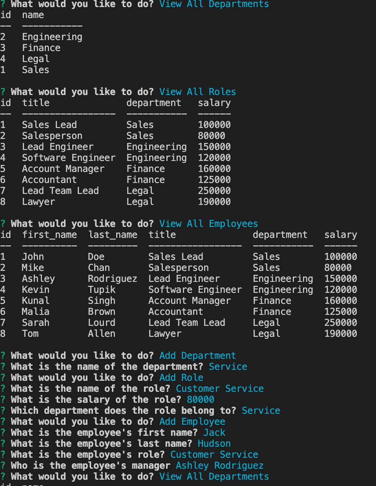
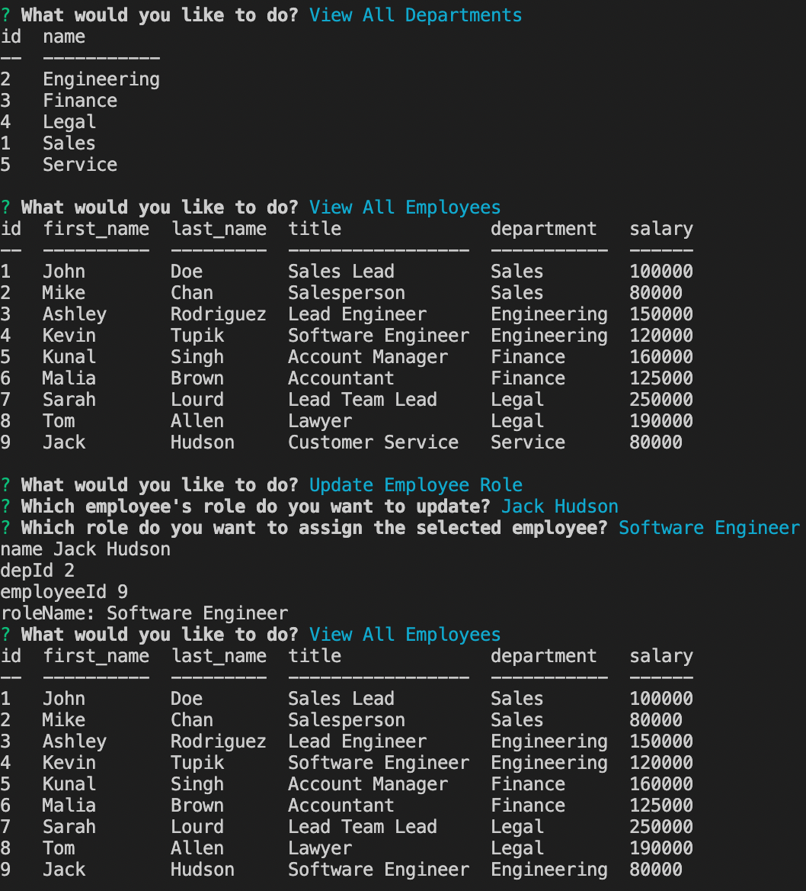

# Sql-Employee-Tracker

## Purpose
To create a commandline application to manage a company's employee database, using Nodejs, Inquirer, and MySQL. When you start the application it will show you some options on what to do.  It allows you to view informations about the company's departments and employees information.  It also allow you to make some changes about to employee such as role changes or department changes.  You can add new employee, new role, or new department to the company.

## Built With:
- Inquirer
- Node.js
- MySQL
- dotenv

# GitHub Link
https://github.com/p-her/sql-employee-tracker

# Video Link
https://drive.google.com/file/d/1vDBlKZQl8jyuVbP-zXZQi6huu-QJJMaw/view

